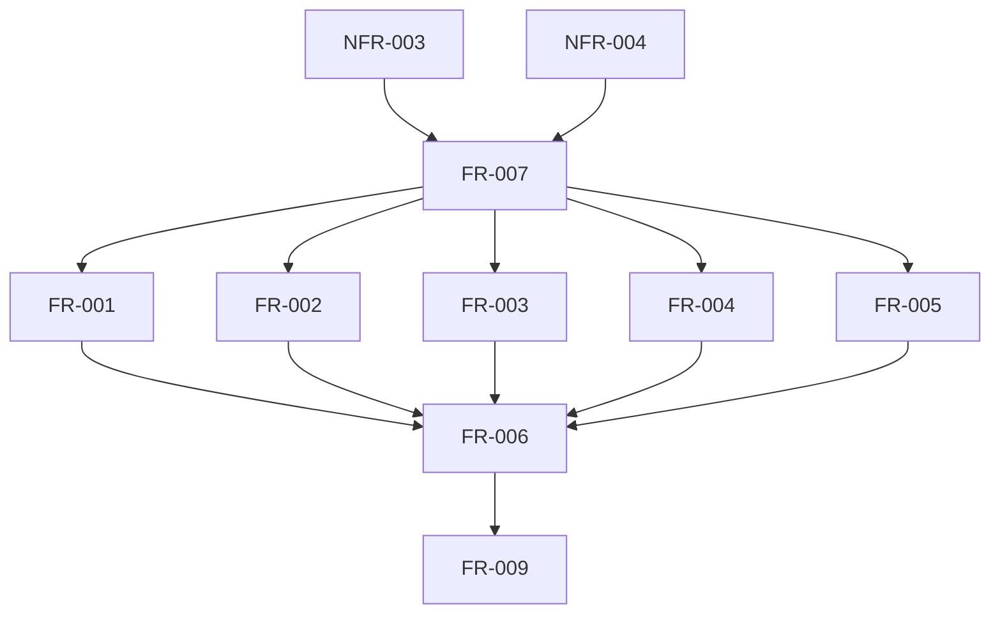

# 要件定義書 - アグリコラ得点計算Webアプリ

## 1. プロジェクト概要

### 1.1 プロジェクト名
アグリコラ得点計算アプリ（AgriCalc）

### 1.2 目的
ボードゲーム「アグリコラリバイズドエディション」のゲーム終了時の得点計算を簡単かつ正確に行うためのWebアプリケーションを提供する。

### 1.3 背景
- アグリコラは複雑な得点計算ルールを持つボードゲーム
- 手動での得点計算は時間がかかり、ミスが発生しやすい
- スマートフォンで手軽に使える計算ツールが必要

### 1.4 スコープ
- アグリコラリバイズドエディションの標準ルールに基づく得点計算
- スマートフォンでの利用に最適化されたUI
- オフライン動作（Webフロントエンドのみで完結）

## 2. ステークホルダー定義

| ステークホルダー | 役割 | 期待値 |
|---|---|---|
| プレイヤー | アプリの主要利用者 | 簡単かつ正確な得点計算、直感的なUI、アイコン中心の操作 |
| 開発者 | アプリの開発・保守担当 | 保守しやすいコード、拡張可能な設計 |

## 3. 機能要件

### 3.1 基本得点計算機能

#### FR-001 [必須] 農場要素の入力
- 畑の枚数（0-15）
- 牧場の枚数（0-15）
- 未使用スペースの枚数（0-15）

#### FR-002 [必須] 家畜の入力
- 羊の数（0-無制限）
- 猪の数（0-無制限）
- 牛の数（0-無制限）

#### FR-003 [必須] 作物の入力
- 穀物の数（0-無制限）
- 野菜の数（0-無制限）

#### FR-004 [必須] 家族と住居の入力
- 家族の人数（2-5）
- 粘土の部屋数（0-15）
- 石の部屋数（0-15）

#### FR-005 [必須] その他要素の入力
- 柵で囲まれた厩の数（0-4）
- カードボーナス点（-無制限-無制限）

#### FR-006 [必須] 得点計算と表示
- 各項目の得点を自動計算
- 項目別得点の内訳表示
- 合計得点の表示

### 3.2 ユーザーインターフェース機能

#### FR-007 [必須] 入力インターフェース
- スマートフォンでのタップ操作に最適化
- 数値入力は＋/−ボタンまたは直接入力
- 入力値のバリデーション
- アイコン中心のUI（文言に頼らない設計）

#### FR-008 [必須] リセット機能
- 全項目の一括リセット
- 個別項目のリセット

#### FR-009 [必須] 計算結果コピー機能
- 計算結果をプレーンテキスト形式でクリップボードにコピー
- 項目別得点と合計得点を含む
- ワンタップ/クリックでコピー可能

## 4. 非機能要件

### 4.1 性能要件

#### NFR-001 [必須] レスポンスタイム
- 得点計算：即座（100ms以内）
- 画面遷移：1秒以内

#### NFR-002 [必須] 対応ブラウザ
- Chrome（最新版）
- Safari（iOS 14以降）
- Firefox（最新版）

### 4.2 ユーザビリティ要件

#### NFR-003 [必須] スマートフォン対応
- レスポンシブデザイン
- タッチ操作最適化
- 画面サイズ：320px-768px対応

#### NFR-004 [必須] 直感的な操作性
- 学習時間：5分以内で基本操作習得
- エラー時の明確なフィードバック
- アイコンのみで理解可能なインターフェース
- 英語のみ対応（最小限の文言使用）

### 4.3 可用性要件

#### NFR-005 [必須] オフライン動作
- ネットワーク接続不要
- セッション内でのデータ保持

### 4.4 保守性要件

#### NFR-007 [推奨] コード品質
- モジュール化された設計
- TypeScriptによる型安全性
- 単体テストカバレッジ80%以上

#### NFR-008 [推奨] ドキュメント
- コードコメント
- README.mdによる使用方法説明

## 5. 制約条件

### 5.1 技術的制約
- Webフロントエンド技術のみ使用（HTML/CSS/JavaScript）
- サーバーサイド処理なし
- 外部APIへの依存なし

### 5.2 リソース制約
- ファイルサイズ：合計1MB以内（圧縮後）
- 初回ロード時間：3秒以内

### 5.3 ルール準拠
- アグリコラリバイズドエディションの公式ルールに準拠
- 得点計算ロジックの正確性

## 6. 要件間の依存関係

## 7. 未確定事項と質問リスト

### 7.1 ゲームルール関連
1. リバイズドエディション特有のルール変更点の詳細確認が必要
2. 拡張版への対応要否
3. 特殊カード（職業カード、小さい進歩カード）の詳細な得点計算ルール

### 7.2 機能関連
1. ダークモード対応の要否
2. アイコンデザインの統一性

### 7.3 技術選定
1. フレームワークの選定（React, Vue, Vanilla JS等）
2. CSSフレームワークの使用可否
3. PWA（Progressive Web App）化の要否

## 8. 優先度マトリクス

| 優先度 | 機能要件 | 理由 |
|---|---|---|
| 高 | FR-001〜FR-006 | 基本的な得点計算機能 |
| 高 | FR-007, FR-008, FR-009 | 基本的なUI機能と結果共有機能 |

## 9. リスク分析

| リスク | 影響度 | 発生確率 | 対策 |
|---|---|---|---|
| ルール理解の誤り | 高 | 中 | 公式ルールブックの詳細確認、テストプレイでの検証 |
| スマートフォンでの操作性不良 | 高 | 低 | 早期プロトタイプでのユーザビリティテスト |
| ブラウザ互換性問題 | 中 | 低 | 主要ブラウザでの動作テスト |

## 10. 成功基準

1. 得点計算の正確性：100%（公式ルールとの一致）
2. ユーザー満足度：初回利用で80%以上が「使いやすい」と評価
3. パフォーマンス：全ての操作が規定時間内に完了
4. エラー率：クリティカルなエラー0件

## 11. 今後のステップ

1. 未確定事項の確認とユーザーへのヒアリング
2. 技術選定と設計フェーズ（`/prj-define-design`コマンド推奨）
3. プロトタイプ開発
4. ユーザビリティテスト
5. 本実装

---

作成日：2024年9月15日
更新履歴：
- v1.0.0：初版作成
- v1.1.0：単一プレイヤー対応、ローカルストレージ機能削除、ヘルプ機能削除、英語・アイコン中心UI対応
- v1.1.1：計算結果のテキストコピー機能追加